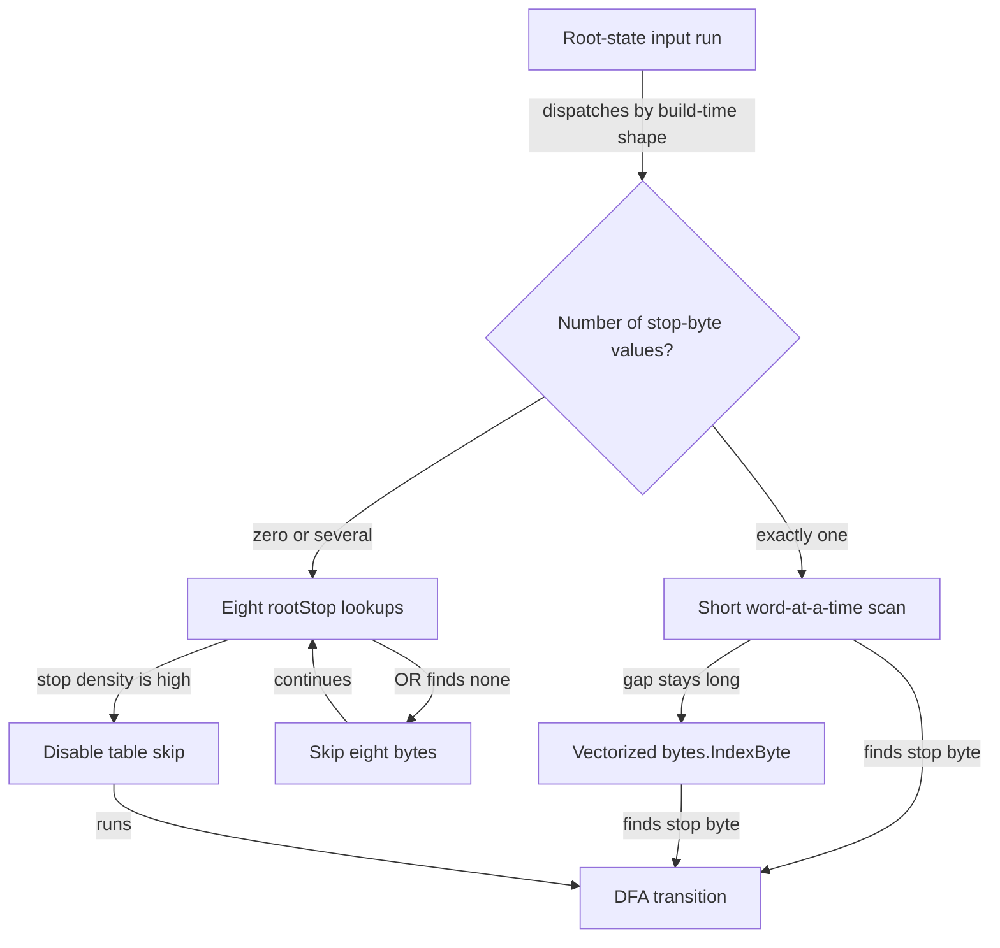
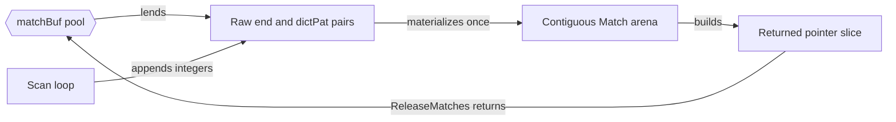

# Chapter 0 — Grounding: the machine we are about to tune

> Baseline: `master` at `ea4bca2`. All code citations in this chapter refer to that commit.

## Concept ledger

- Chapter 0: trie, failure link, dictionary link, DFA row, regime, geomean, cache hierarchy, serial dependency chain, Go slice, bounds check, `unsafe.Add`, pooled materialization, overlap scan, dual cursor.

## Act 0 — Grounding

This stack does not begin with slow code. The baseline already skips useless input, uses smaller tables when it can, reuses match memory, and scans large inputs in parallel. The next 19 commits improve that strong base. The chain reports a geomean time reduction of 41.1% versus this baseline, and a 95.5% build-time reduction. Those are final-chain measurements from `PR-CHAIN.md:3-14` and the executed appendix in `COMPARISON.md:125-145`; they were not re-measured for this guide.

## Aho-Corasick in five minutes

A **trie** shares prefixes. With the patterns `he`, `she`, `his`, and `hers`, both `he` and `hers` reuse the path `h → e`.

A **failure link** says where to continue after a mismatch. It points to the longest suffix of the current text that is also a trie prefix. A **dictionary link** points to another completed pattern. At state `she`, that link finds `he` without rescanning the input.

Edges labeled `trie byte` add a byte. The `fail` and `dict` labels are links used when the direct trie path is not enough.

```mermaid
stateDiagram-v2
    [*] --> root
    root --> h : trie byte h
    root --> s : trie byte s
    h --> he : trie byte e
    h --> hi : trie byte i
    he --> her : trie byte r
    her --> hers : trie byte s
    hi --> his : trie byte s
    s --> sh : trie byte h
    sh --> she : trie byte e
    sh --> h : fail
    she --> he : fail and dict
    his --> s : fail
    hers --> s : fail
```

Trace `ushers`:

| Byte | State after byte | Output |
|---|---|---|
| `u` | root | — |
| `s` | `s` | — |
| `h` | `sh` | — |
| `e` | `she` | `she`, then dictionary link → `he` |
| `r` | `her` | — |
| `s` | `hers` | `hers` |

The builder turns these links into a deterministic finite automaton, or **DFA**: one ready-made next-state answer for every `(state, byte)` pair. Scanning then performs one transition per input byte, independent of the number of patterns. Its transition work is O(input length). Reporting `z` matches adds the unavoidable O(z) output work.

The baseline computes failure and dictionary links, numbers states breadth-first, then fills every transition (`builder.go:158-239`). The real code is longer; this excerpt keeps the ordering that matters:

```go
// builder.go:181-230 @ ea4bca2
newID := make([]uint32, numStates)
order := make([]*state, 0, numStates)
order = append(order, tb.states[0], tb.root)
newID[tb.root.id] = 1
...
for qi := 1; qi < len(order); qi++ {
    s := order[qi]
    ... // visit children in sorted byte order
    newID[t.id] = uint32(len(order))
    order = append(order, t)
}
...
for i, s := range order {
    ...
    for b := range 256 {
        c := byte(b)
        trie.failTrans[i][c] = newID[tb.computeFailTransition(s, c)]
    }
}
```

Breadth-first search, or **BFS**, assigns nearby IDs to shallow states. Those hot rows sit together in memory. Sorting child bytes also makes `Encode` reproducible.

## The baseline's core layout

`failTrans` is `[][256]uint32`: 256 four-byte entries make each state row 1,024 bytes. “Goto + fail fused” means a scan loads one entry instead of walking failure links at run time (`trie.go:12-68`).

```text
failTrans
             byte 0        byte 1                         byte 255
state 0   ┌────────────┬────────────┬ ··· ┬────────────┐  1,024 B
state 1   ├────────────┼────────────┼ ··· ┼────────────┤  1,024 B  ← root
state 2   ├────────────┼────────────┼ ··· ┼────────────┤  1,024 B
          └────────────┴────────────┴─────┴────────────┘
             one uint32 transition entry

transition entry                         dictPat[state]
31                    0                  63             32 31              0
┌──────┬───────────────┐                 ┌────────────────┬─────────────────┐
│ emit │ next state ID │                 │ pattern number │ pattern length  │
└──────┴───────────────┘                 └────────────────┴─────────────────┘
 1 bit      31 bits                           32 bits          32 bits

BFS row order: [unused][root][depth 1 rows][depth 2 rows][deeper rows ...]
```

The emit flag rides on the transition load. If it is clear, the common no-output path touches no output arrays. If set, `dictPat` supplies pattern ID and length in one load; `dictLink` walks any additional outputs (`trie.go:134-159`).

## The hardware constraint: waiting for the next state

Caches are small memories close to a CPU core. The closer the data, the shorter the wait. This rough ladder is orientation, not a measurement of this repository or a promise for every CPU:

```text
                 smaller, nearer, faster
CPU registers  ───────────────────────────  ~0–1 cycles
L1 cache       ───────────────────────────  ~4 cycles
L2 cache       ───────────────────────────  ~10–15 cycles
L3 cache       ───────────────────────────  ~30–60 cycles
DRAM           ───────────────────────────  ~100–300 cycles
                 larger, farther, slower
```

The central problem is not merely “table loads are expensive.” The next address cannot be known until the current load returns:

```text
sᵢ + input[i] ──compute address──► load failTrans[sᵢ][input[i]] ──► sᵢ₊₁
                                                                         │
                                                                         └── needed to compute
                                                                             the next address
```

This is the **serial dependency chain**. A normal loop can have many independent loads in flight. This loop naturally exposes one. Much of the stack either removes work from this chain, shrinks the table it loads, or creates another independent chain.

> Want the deep-dive? Ask for cache lines, hardware prefetching, or why “one dependent load” differs from bandwidth.

## Go slices, bounds checks, and `unsafe.Add`

A Go slice is a small descriptor: data pointer, length, and capacity. An access such as `table[index]` normally checks `index < len(table)` and panics if false. That safety is cheap in many loops, but a check on this dependency chain can matter.

The baseline's specialized match loop uses raw pointer arithmetic (`trie.go:789-853`):

```go
// trie.go:845-853 @ ea4bca2
v := *(*uint32)(unsafe.Add(ftBase,
    uintptr(s)<<10+uintptr(input[i])<<2))
s = v & stateMask
if v&outputFlag != 0 {
    if dp := *(*uint64)(unsafe.Add(dpBase, uintptr(s)<<3)); uint32(dp) != 0 {
        buf.raw = append(buf.raw, uint64(i), dp)
    }
    ...
}
```

`unsafe.Add(base, offset)` returns an address `offset` bytes after `base`. Here `s << 10` chooses a 1,024-byte row and `input[i] << 2` chooses a four-byte column. It avoids a bounds check, but also asks the programmer to prove every table state is valid. The builder and decoder enforce that invariant. Later chapters return to this risk discipline.

> Want the deep-dive? Ask to see the slice descriptor, the compiler's bounds-check branch, or `checkptr`.

## Five optimizations already present

### 1. Root self-loop skip

At the root, most bytes often return to the root and cannot emit. The baseline skips a run instead of performing a full DFA step for each byte (`trie.go:196-263`). A **stop byte** is a byte that leaves the root.



The word scan is SWAR: “SIMD within a register,” using one integer operation across several byte lanes. `bytes.IndexByte` may use wider CPU vector instructions. Chapter 3 builds both ideas from bits upward; for now, the point is simply “search for the rare useful byte faster than one full DFA step at a time.”

### 2. A half-width table

When every state fits in 15 bits and the root has one stop byte, the baseline builds `failTrans16` (`trie.go:161-185`).

```text
32-bit row: 256 × 4 B = 1,024 B     [emit:1 | state:31]
16-bit row: 256 × 2 B =   512 B     [emit:1 | state:15]
                                      └─ half as many bytes per row load footprint

root + sole stop byte ──► stopEntry16 constant ──► no root-row load
```

Smaller rows give the cache room for more states. The cached `stopEntry16` also removes a dependent table load whenever scanning leaves the root.

### 3. Pooled raw matches, then materialization

Allocating a Go object for every hit would involve the allocator and the garbage collector, or **GC**. The baseline records pointer-free integer pairs first. It creates the public `Match` values only after the final count is known (`trie.go:70-131`, `trie.go:420-449`, `trie.go:925-946`).



“Zero allocation” here means the sequential steady state can reuse existing capacity. The pool still needs careful ownership: after `ReleaseMatches`, the result must not be read.

> Want the deep-dive? Ask about Go write barriers, `sync.Pool`, or how stale slice pointers can retain an old input.

### 4. Parallel `Match` with overlap

For inputs of at least 16 KiB, the baseline may use up to eight goroutines. A goroutine is a lightweight Go task. Each worker starts `maxLen-1` bytes before its owned chunk, because no match can begin earlier and still end inside that chunk (`trie.go:416-429`, `trie.go:704-786`).

```text
input:     0                         B                        2B
           ├──── worker 0 owns ─────┼──── worker 1 owns ─────┤
worker 0:  [ scan from root ─────────)
worker 1:                [ overlap ][ scan from root ─────────)
                         ◄─ L - 1 ─►
worker 1 emits:                       [ only ends ≥ B ─────────)

L = longest pattern length. Overlap outputs before B are discarded.
```

That rule finds seam-crossing matches once, in the same order as a sequential scan. If overlap would be too large relative to a chunk, the code stays sequential.

### 5. Dual cursor inside one goroutine

The 16-bit single-stop path can split one input into two overlapping halves. It interleaves two automaton states, `sA` and `sB` (`trie.go:541-639`).

```text
conceptual time ─────────────────────────────────────────────►
lane A           issue load A0      use A0, issue A1      use A1
lane B                 issue load B0      use B0, issue B1      use B1
                       └──── independent waits can overlap ────┘
```

This is not two goroutines. It is one loop with two independent dependency chains. Lane B begins `maxLen-1` bytes before the midpoint and emits only at or after the midpoint. Chapter 4 will teach the CPU idea—memory-level parallelism—in full.

The baseline dispatcher also uses direct scan functions for `Match`, avoiding a callback call for every output. `Walk` keeps the callback API. The real sequential choice is compact (`trie.go:455-473`):

```go
// trie.go:456-472 @ ea4bca2
func (tr *Trie) matchSeq(input []byte, buf *matchBuf) {
    if tr.failTrans16 != nil && len(tr.rootStopBytes) == 1 {
        if len(input) >= dualThreshold && int(tr.maxLen)*4 < len(input)/2 {
            tr.matchDualStopByte16(input, buf)
            return
        }
        tr.matchStopByte16(input, buf)
        return
    }
    if len(tr.rootStopBytes) == 1 {
        tr.matchStopByte(input, buf)
    } else {
        tr.matchTable(input, buf)
    }
}
```

## How this guide measures change

A **regime** is a recognizable workload condition that changes which cost dominates. “No matches and one stop byte” is one regime. “Dense output from a large trie” is another. The same optimization can win one and lose the other.

```text
                         INPUT REGIME
TRIE SHAPE       prose   no-match   dense-output   long input   build
───────────────  ─────   ────────   ────────────   ──────────   ─────
single-stop        ×         ×            ×             ×
multi-stop         ×         ×            ×             ×
large 32-bit       ×                                      ×
small 16-bit       ×         ×
patterns only                                                  ×
```

The committed harness makes that matrix concrete with single-stop, multi-stop, big, no-match, dense, `Walk`, `MatchFirst`, build, parallel-crossover, in-automaton, and density-sweep benchmarks (`bench_lab_test.go:3-6` and `59-211` at `f614e9a`). Chapter 1 will inspect it line by line.

Each performance commit is compared with its **direct parent**, not only with the final baseline. The repository used interleaved A/B binaries, repeated samples (`n=6–8`), and `benchstat` (`PR-CHAIN.md:10-14`). Repetition exposes run-to-run noise. A reported `±` interval is uncertainty, not extra speed; a wide interval means the result needs caution.

A **geomean** combines ratios rather than raw times. If one benchmark becomes 2× faster and another 2× slower, multiplying the two ratios gives 1, so their geometric mean is neutral. This prevents a slow benchmark measured in milliseconds from drowning out a fast benchmark measured in nanoseconds. It is a summary, never a replacement for the matrix.

> Want the deep-dive? Ask how `benchstat` tests A/B samples, how confidence intervals should be read, or why arithmetic means mislead for ratios.

## Recap

- Aho-Corasick makes transition work linear in input length by precomputing one next-state answer for every state and byte.
- The baseline is already a cache-aware DFA with root skipping, half-width rows, pooled outputs, parallel chunks, and a dual cursor.
- Performance claims belong to regimes: compare each commit with its direct parent across a matrix, then use geomean only as a summary.

## Check yourself

1. Why can the scanner not compute the address of transition `i+1` before transition `i` returns?
2. Why must a parallel worker rescan `maxLen-1` bytes before its owned chunk?

## Optional deep-dives

- Build the full DFA for `{he, she, his, hers}` by hand.
- Trace cache lines and dependent loads for one input byte at a time.
- Expand the SWAR zero-byte trick and `bytes.IndexByte` into bit and SIMD diagrams.
- Inspect Go bounds-check assembly and the `unsafe.Add` invariant.
- Trace pool ownership, GC write barriers, and stale-input retention.
- Prove the overlap rule for parallel and dual-cursor scans.
