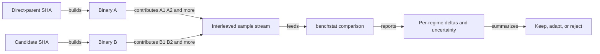

# Chapter 1 — The measurement harness: ask more than one question

> Stack PR 1: `test/08-lab-bench-harness` at `f614e9a`, direct parent `ea4bca2`.

## Concept ledger

- Chapter 0 — trie, failure and dictionary links, DFA rows, BFS layout, and output packing.
- Chapter 0 — cache hierarchy, the serial dependency chain, Go bounds checks, and `unsafe.Add`.
- Chapter 0 — root skipping, half-width rows, pooled materialization, parallel overlap, and dual cursors.
- Chapter 0 — workload regime and geomean; this chapter turns them into an experiment.

## Act I — Measure, then build

The first performance commit does not optimize anything. It fixes the questions we ask. Chapter 2 can then rewrite the builder without guessing which workloads improved or regressed.

## The bottleneck: a blind instrument

The parent already had useful benchmarks. `BenchmarkTrieBuild` swept pattern counts. `BenchmarkMatchIbsen` swept input sizes. Separate root-skip benchmarks covered real corpora, stop-byte density, and stop-byte cardinality (`trie_test.go:187-250` and `rootskip_bench_test.go:111-203` at `ea4bca2`).

But a fast result there did not describe the whole matcher. It could miss a slow multi-stop table path, dense output handling, a large 32-bit automaton, `Walk`, `MatchFirst`, or the point where parallel work becomes worthwhile. One benchmark is one window.

```text
                         INPUT REGIME
TRIE / API        prose   no-match   dense output   size sweep   build
────────────────  ─────   ────────   ────────────   ──────────   ─────
single-stop         ✓         ✓            ✓             ✓
multi-stop          ✓         ✓            ✓             ✓
large 32-bit        ✓                                      ✓
Walk callback       ✓
MatchFirst late     ✓
patterns only                                                  ✓
```

A **regime** is not merely a data file. It is a set of conditions that makes one cost dominate: trie shape, input content, input size, API, and output rate together. Optimizing one cell can hurt another.

## The idea

Freeze a matrix of regimes once. Run that same matrix against the direct parent and the candidate commit. Keep a change only when the per-row evidence explains both its wins and its costs.

That is the whole chapter in dinner-table form: **measure the cases where the machine behaves differently, not just the case you expect to win.**

## New concept: disciplined A/B comparison

“A/B” means two otherwise identical trials:

- A is the direct parent.
- B is the one-commit change.
- The benchmark, data, machine, and command stay fixed.

The repository's later measurements use repeated, interleaved A/B binaries and `benchstat`; per-commit runs use `n=6–8` (`PR-CHAIN.md:10-14`). Interleaving means running A and B in alternating order instead of finishing all A samples first. If the machine warms up or background load drifts, both sides experience the drift.



Two counts are easy to confuse:

- `b.N` is how many loop iterations Go runs inside one benchmark sample.
- `n` is how many independent sample results are collected for comparison.

Repeating samples exposes **noise**: timing variation unrelated to the code change. A `±` confidence interval is an uncertainty band around an estimate. A narrow interval supports a precise claim. A wide one says the experiment cannot distinguish a small change from noise. `benchstat` compares the sample distributions; it does not bless a single fast run.

When the evidence cannot separate A from B, this stack writes `~`, not “faster.” That restraint matters as much as finding a win.

> Want the deep-dive? Ask about confidence intervals, hypothesis tests, outliers, or why paired/interleaved experiments are stronger than two batches.

## The mechanism: construct the matrix deliberately

The harness creates different trie shapes from the same word list. A sorted 10,000-pattern prefix gives the single-stop path. Taking every tenth pattern spreads first bytes across the alphabet and gives a multi-stop trie under the 15-bit state limit (`bench_lab_test.go:39-78` at `f614e9a`).

```go
// bench_lab_test.go:39-78 @ f614e9a
func stride10k(patterns []string) []string {
    out := make([]string, 0, 10000)
    for i := 0; i < len(patterns) && len(out) < 10000; i += 10 {
        out = append(out, patterns[i])
    }
    return out
}

func benchMatch(b *testing.B, tr *Trie, input []byte) {
    b.SetBytes(int64(len(input)))
    b.ReportAllocs()
    for n := 0; n < b.N; n++ {
        ms := tr.Match(input)
        tr.ReleaseMatches(ms)
    }
}

func BenchmarkLabSingleStop(b *testing.B) { ... }
func BenchmarkLabMultiStop(b *testing.B) { ... }
```

`SetBytes` lets Go report throughput. `ReportAllocs` keeps allocation regressions visible. `ReleaseMatches` follows the ownership contract from Chapter 0 so the benchmark measures steady-state buffer reuse.

Input construction then isolates costs:

| Benchmark family | Condition it creates | Cost exposed |
|---|---|---|
| `SingleStop`, `MultiStop`, `Big` | same prose, different table shapes and sizes | transition path and cache footprint |
| `NoMatch` | seeded digits that never start a word | root skipping |
| `Dense`, `MultiDense` | short overlapping patterns or concatenated words | output and in-automaton work |
| `Walk`, `MatchFirstLate` | callback API or late first hit | API-specific overhead |
| `ParaCross`, `ParaCrossMulti` | growing input sizes | parallel crossover |
| `DensitySweep`, `DenseSize` | controlled gaps or sizes | dispatch break-even |
| `MultiSmall`, `Skip2` | small multi-stop or exactly two stop bytes | otherwise hidden specializations |
| `Build10k` | construction only | builder cost |

The synthetic inputs are repeatable. `NoMatch` uses a fixed random seed. `DensitySweep` writes the measured stop-byte density into each sub-benchmark name (`bench_lab_test.go:87-114` and `208-229` at `f614e9a`).

```go
// bench_lab_test.go:208-229 @ f614e9a
func BenchmarkLabDensitySweep(b *testing.B) {
    patterns, _ := labLoad(b)
    tr := NewTrieBuilder().AddStrings(patterns[:10000]).Build()
    c := tr.rootStopBytes[0]
    for _, gap := range []int{0, 4, 8, 16, 32, 64} {
        var sb []byte
        i := 0
        for len(sb) < 96<<10 {
            sb = append(sb, patterns[i%10000]...)
            for g := 0; g < gap; g++ {
                sb = append(sb, 'x')
            }
            i++
        }
        input := sb[:96<<10]
        density := float64(bytes.Count(input, []byte{c})) / float64(len(input))
        b.Run(fmt.Sprintf("gap%d-d%.3f", gap, density),
            func(b *testing.B) { benchMatch(b, tr, input) })
    }
}
```

The second new file, `characterize_test.go`, prints states, table width, stop-byte count, longest pattern, match count, and dictionary-link depth. It answers “which path did this benchmark actually reach?” before anyone interprets a timing (`characterize_test.go:9-70` at `f614e9a`).

## The numbers

There is no speed result for this commit. Its commit message contains only the test-harness subject, and `PR-CHAIN.md:24` records the A/B column as `—`. The diff adds 382 test lines across two new files and changes no production file.

That absence is deliberate. A measurement tool is not a performance improvement. Its payoff is that every later chapter can cite an A/B against its direct parent on the same matrix. No benchmarks were re-run for this chapter.

## Why it is safe—and what it cannot prove

Runtime behavior is unchanged because both added files end in `_test.go`. The harness uses fixed corpora and seeded synthetic data. Shape assertions fail loudly when a benchmark no longer reaches its intended path—for example, `MultiStop` rejects a one-stop trie and `MultiSmall` checks state width and stop count.

The benchmark helper also releases pooled results. The diagnostic test skips cleanly when local corpus files are absent. According to `PR-CHAIN.md:3-8`, every position in the chain passes `go test ./...`; the full chain also passes race, `checkptr`, fuzz, deterministic-encode, and DP-equivalence gates.

But a benchmark is not a correctness proof. It may not inspect returned matches, and a fixed matrix can still have blind spots. Chapter 12 adds new corpora after parallel research exposes missing midsize and output-heavy regimes. The right response to a blind spot is to add a stable row, not to discard measurement discipline.

## Recap

- One benchmark describes one regime; this harness freezes a matrix across trie shape, input, size, API, output rate, and build work.
- A fair A/B changes one commit, interleaves repeated samples, and treats confidence intervals as limits on what can be claimed.
- This commit makes no speed claim and changes no runtime code; it creates the evidence base for the next 18 chapters.

## Check yourself

1. Why are `b.N` and the experiment's sample count `n` different quantities?
2. Why can an optimization look good on `BenchmarkMatchIbsen` yet regress `NoMatch` or `Dense`?

## Optional deep-dives

- How Go chooses `b.N`, and how `-benchtime` and `-count` change an experiment.
- How `benchstat` estimates centers, confidence intervals, and significance.
- How to design paired and randomized benchmark schedules on a noisy host.
- How to add a new regime without accidentally measuring setup work.
