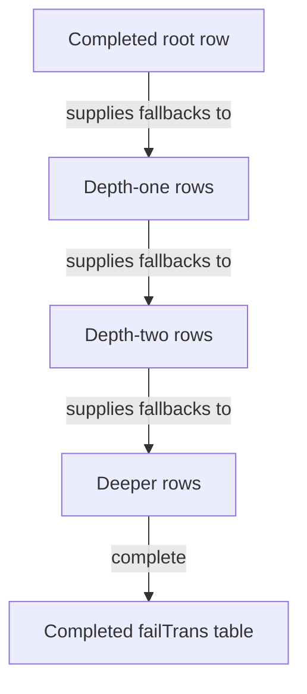

# Chapter 2 — Build each DFA row from a row already solved

> Stack PR 2: `perf/09-row-copy-build` at `9ea70e1`, direct parent `f614e9a`.

## Concept ledger

- Chapter 0 — trie, failure and dictionary links, DFA rows, BFS layout, cache hierarchy, and the serial dependency chain.
- Chapter 0 — root skipping, half-width rows, pooled materialization, parallel overlap, and dual cursors.
- Chapter 1 — regime matrices, direct-parent A/B comparison, sample count, noise, confidence intervals, and `benchstat`.

## The bottleneck: rediscovering the same answer

The final automaton needs one transition for every state and every possible byte. The parent built each entry independently. For `(state, byte)`, it looked in the state's `map[byte]*state`; on a miss it followed a failure link and looked in another map, repeating until it found a child or reached the root (`builder.go:220-252` at `f614e9a`).

```text
for every state
└─ for each of 256 bytes
   ├─ map lookup in this state
   ├─ miss? follow fail pointer
   ├─ map lookup in fail state
   ├─ miss? follow fail pointer again
   └─ eventually produce one transition entry
```

That work has three costs:

- A Go map lookup performs hash/bucket machinery even for a one-byte key.
- Maps and their buckets add allocations and pointer chasing.
- The same failure-chain facts are rediscovered for many bytes and many descendant states.

The old builder also had to extract and sort every map's keys before BFS numbering, because Go map iteration order is deliberately unstable.

## The idea

The transition row of a state is almost the transition row of its failure state. Copy that completed row, then overwrite the bytes for the state's own children.

In one equation:

```text
row(s) = copy(row(fail(s)))
         then, for each direct child c of s:
         row(s)[c.byte] = c.state
```

At dinner: **inherit every fallback answer at once; patch only the exceptions.**

## New concept: maps versus tiny sorted slices

The builder replaces each state's map with a slice of child pointers kept in byte order (`builder.go:11-52` at `9ea70e1`).

```text
BEFORE: one map per state

state ──trans──► map header ──selects bucket──► bucket entries ──loads──► child
                allocation                        scattered metadata

AFTER: one sorted slice per state

state ──children──► [ *child('a') | *child('h') | *child('z') ]
                     contiguous pointer slots, already ordered
                              ▲
                              └── binary search compares child.value
```

A **binary search** checks the middle item, discards half the remaining range, and repeats. Its lookup cost grows as O(log fan-out). Insertion is O(fan-out) because later pointers shift right. That sounds like a poor trade for a large collection, but the commit's premise is that pattern-trie fan-out is usually tiny. The slice still follows child pointers; it removes map machinery and per-state map allocation rather than making all state data contiguous.

```go
// builder.go:28-52 @ 9ea70e1
func (s *state) child(c byte) *state {
    lo, hi := 0, len(s.children)
    for lo < hi {
        mid := (lo + hi) / 2
        if s.children[mid].value < c {
            lo = mid + 1
        } else {
            hi = mid
        }
    }
    if lo < len(s.children) && s.children[lo].value == c {
        return s.children[lo]
    }
    return nil
}

func (s *state) insertChild(t *state) {
    i := sort.Search(len(s.children),
        func(k int) bool { return s.children[k].value >= t.value })
    s.children = append(s.children, nil)
    copy(s.children[i+1:], s.children[i:])
    s.children[i] = t
}
```

Because insertion preserves byte order, BFS can iterate `children` directly. It no longer gathers map keys into scratch space and sorts them.

> Want the deep-dive? Ask for Go map buckets, binary-search traces, or when a map becomes better than a sorted slice.

## The mechanism: row-copy DFA construction

Use the Chapter 0 patterns. The state `sh` fails to `h`: after text ending in `sh`, a mismatch can still retain suffix `h`. The completed row for `h` already knows every fallback answer.

```text
Patterns: he, she, his, hers                    fail(sh) = h

byte                 e       i       h       s       other
──────────────────  ─────   ─────   ─────   ─────   ─────
completed row(h)      he      hi       h       s      root
copy into row(sh)     he      hi       h       s      root
own child overwrite  she      ·       ·       ·        ·
──────────────────  ─────   ─────   ─────   ─────   ─────
completed row(sh)    she      hi       h       s      root
```

The `e` transition is local to `sh`, so it becomes `she`. Every other answer is exactly what the failure state `h` would do. One array copy replaces up to 256 separate failure-chain searches.

Why is the source row ready? A failure link always points to a shorter prefix, hence a shallower trie state. BFS processes all shallower states first:



The real builder first initializes the unused row and root row. It then walks states in BFS order, copies the failure row with Go array assignment, and patches direct children (`builder.go:237-270` at `9ea70e1`):

```go
// builder.go:237-270 @ 9ea70e1
rootRow := &trie.failTrans[1]
for b := range 256 {
    rootRow[b] = 1
}
for _, t := range tb.root.children {
    rootRow[t.value] = newID[t.id]
}
row0 := &trie.failTrans[0]
for b := range 256 {
    row0[b] = 1
}

trie.dict[1] = tb.root.dict
trie.pattern[1] = tb.root.pattern
for i := 2; i < numStates; i++ {
    s := order[i]
    trie.dict[i] = s.dict
    trie.pattern[i] = s.pattern
    if s.dictLink != nil {
        trie.dictLink[i] = newID[s.dictLink.id]
    }
    trie.failTrans[i] = trie.failTrans[newID[s.failLink.id]]
    for _, t := range s.children {
        trie.failTrans[i][t.value] = newID[t.id]
    }
}
```

The final table has the same shape and entry meaning as before. Only its construction changes.

## Determinism is part of correctness

State IDs become positions in `dict`, `dictLink`, and `failTrans`, then bytes in `Encode`. If sibling order changes between builds, semantically equivalent tries can serialize differently. That breaks stable checksums and cache keys.

The parent repaired map randomness by sorting keys before BFS. The new builder preserves that same byte order structurally: `insertChild` keeps the slice sorted, and BFS visits the slice from left to right (`builder.go:211-224` at `9ea70e1`). Thus the optimization removes sorting work without changing numbering.

## The numbers

The commit message reports direct-parent A/B measurements on Zen 4 with `n=6` and `benchstat`:

| Benchmark | Parent | `9ea70e1` | Change |
|---|---:|---:|---:|
| `LabBuild10k` | 172.5 ms | 18.3 ms | −89.4% |
| `TrieBuild/100000` | 2,308 ms | 112 ms | −95.2% |
| allocations | — | — | about 28% fewer |

The production target is build time. Match code and the final table format are unchanged. The message reports match rows as unchanged or 2–8% faster, but attributes that to BFS locality even though the parent already used the same sorted-byte BFS numbering. Treat those scan deltas as non-regression evidence, not as a causal benefit of this diff.

One source inconsistency is worth recording: the prose summary says the 100,000-pattern build improved by “~94%,” while its exact A/B row says −95.2% and `PR-CHAIN.md:25` rounds it to −95%. This chapter uses the exact A/B row. No benchmarks were re-run locally.

## Why it is safe

The recurrence is the core proof. For any state `s` and byte `b`:

- If `s` has a child on `b`, the overwrite installs the required direct transition.
- Otherwise, Aho-Corasick says to behave as `fail(s)` would on `b`; the copied entry is exactly that answer.
- BFS guarantees `row(fail(s))` is complete before `row(s)` is copied.

Sorted children preserve the parent's byte-order numbering, so the wire layout remains unchanged. Coverage present at this commit includes the random differential test against a naive matcher, `FuzzMatch`, `FuzzEncodeDecode`, decode validation, and `TestEncodeDeterministic` (`differential_test.go:45-103`, `fuzz_test.go:135-215`, and `stream_test.go:282-309` at `9ea70e1`). `PR-CHAIN.md:3-8` says every chain position passes `go test ./...`.

There is a second documentation discrepancy: the commit message says a deterministic-encode regression test was added, but the diff modifies only `builder.go`. `TestEncodeDeterministic` is already present in both parent and child. The change preserves and is covered by that test; it does not add it.

The trade-off is deliberate. A state with very high fan-out may favor a map because slice insertion shifts pointers. For these pattern sets, the combined builder wins decisively; the commit chooses slices because fan-out is usually tiny. The builder still allocates pointer-based state objects; Chapter 19 removes that remaining layer.

## Recap

- The old builder searched failure chains through maps for every `(state, byte)`; the new builder copies one solved failure row and patches direct children.
- Tiny sorted child slices remove map allocation and keep byte order by construction, at the cost of O(fan-out) insertion.
- BFS makes row copy valid and deterministic; direct-parent build time falls 89.4% at 10,000 patterns and 95.2% at 100,000.

## Check yourself

1. Why must `fail(s)` be processed before `s` for row copy to be correct?
2. In `row(sh)`, why is copying `row(h)` correct for every byte except `sh`'s own child bytes?

## Optional deep-dives

- Go's map layout, bucket lookup, and allocation behavior for byte keys.
- A step-by-step binary search and sorted insertion trace.
- A formal proof of the row-copy recurrence for all states and bytes.
- The machine code Go emits for a 1,024-byte array assignment.
- How deterministic state numbering leads to byte-identical serialized tries.
