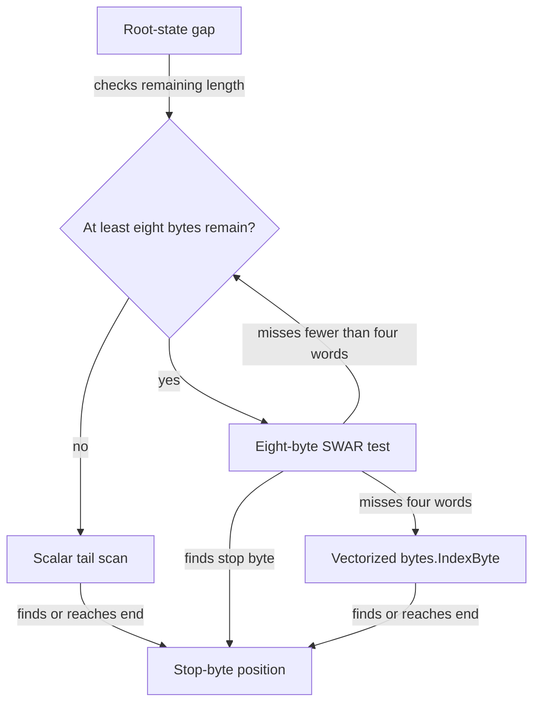

# Chapter 3 — Skip the whole root gap, not eight bytes at a time

> Stack PR 3: `perf/10-dual-full-gap-skip` at `3d8c3a8`, direct parent `9ea70e1`.

## Concept ledger

- Chapter 0 — DFA rows, the serial dependency chain, root self-loops, stop bytes, half-width rows, and dual cursors.
- Chapter 1 — regime matrices, direct-parent A/B comparison, sample count, noise, confidence intervals, and `benchstat`.
- Chapter 2 — sorted child slices, binary search, row-copy DFA construction, BFS ordering, and deterministic encoding.

## Act II — The single-stop scan

Chapters 3–5 improve tries whose root leaves on one byte value. The scanner can ignore every other byte while it remains at the root. The question is how to find that one useful byte with the least overhead for both short and long gaps.

## The bottleneck: a full-gap tool used eight bytes at a time

The baseline dual cursor interleaves two lanes to overlap their dependent transition loads. But while a lane sat at the root, one loop iteration could skip at most eight self-loop bytes. A long gap therefore repeated the dual loop, its conditions, and both lanes' branch work once per eight bytes. Unlike the sequential scan, it never escalated to `bytes.IndexByte` (`trie.go:567-624` at `9ea70e1`).

```text
BEFORE — a 40-byte root gap in lane A

dual-loop iteration     1        2        3        4        5
lane A progress       +8 B     +8 B     +8 B     +8 B     +8 B
lane B work           branch   branch   branch   branch   branch
                      └──────── repeated loop overhead ────────┘

AFTER

one lane step ──nextStop──► searches the whole gap ──► first stop byte
```

There is no dependent table load to overlap while a lane is skipping root self-loops. The old eight-byte bound preserved interleaving exactly where interleaving was least useful.

## The idea

Give each lane the sequential path's complete skip operation: inspect a few machine words cheaply, then hand a proven-long gap to the vectorized library search.

At dinner: **when the automaton is doing nothing, skip all of the nothing in one step.**

## New concept: SWAR

**SWAR** means “SIMD within a register.” Instead of comparing one input byte at a time, ordinary 64-bit integer operations treat one word as eight byte lanes. This is not a vector instruction. It is a scalar integer trick that performs the same test across eight packed bytes.

`nextStop` wants to find byte `c`. It first replicates `c` into all eight lanes:

```text
swarOnes = 0x0101010101010101
c = 0x61 ('a')
cc = uint64(c) * swarOnes = 0x6161616161616161
```

Then it XORs eight input bytes with `cc`. Equal bytes become zero. For the example below, lane 0 is the lowest-address and least-significant byte:

```text
lane                 0      1      2      3      4      5      6      7
input                x      q      a      m      z      !      b      c
input XOR 'a'       0x19   0x10   0x00   0x0c   0x1b   0x40   0x03   0x02
zero-byte mask      0x00   0x00   0x80   0x00   0x00   0x00   0x00   0x00
                                      ▲
                                      └── first matching lane
```

The mask comes from the classic zero-byte test:

```text
m = (w - 0x0101010101010101) & ^w & 0x8080808080808080
```

For a zero lane, subtracting one makes its high bit set; `^w` keeps that bit only where the original lane's high bit was clear; `swarHighs` keeps only lane high bits. `bits.TrailingZeros64(m)` locates the lowest set bit. Shifting that bit index right by three divides by eight and yields the byte-lane index. In the example, bit 23 becomes lane 2.

The subtraction is one 64-bit operation, so borrows can cross lane boundaries. The important guarantee for this use is that the lowest marked lane is a real zero; that makes `TrailingZeros64` safe for locating the first match.

> Want the deep-dive? Ask for the borrow proof, a binary trace of all three masks, or the x86-64 instructions Go emits.

## New concept: `bytes.IndexByte` and the skip ladder

On supported targets, Go implements `bytes.IndexByte` with vectorized machine code. **SIMD** instructions compare many bytes in wide vector registers. The vectorized search has setup overhead, so invoking `IndexByte` for every short gap can cost more than it saves.

The helper chooses among three tools based on what the input has already revealed:



The normal path tries up to four SWAR words: 32 bytes. If all miss, the gap is long enough to justify `IndexByte`. Scalar code handles the final tail when fewer than eight bytes remain. The threshold is a performance choice; all three tools return the same first position.

## The mechanism

`nextStop` packages that ladder as a pure position search (`trie.go:541-568` at `3d8c3a8`):

```go
// trie.go:546-568 @ 3d8c3a8
func nextStop(input []byte, i int, c byte, cc uint64) int {
    inputLen := len(input)
    for k := 0; ; k++ {
        if i+8 > inputLen {
            for i < inputLen && input[i] != c {
                i++
            }
            return i
        }
        w := binary.LittleEndian.Uint64(input[i:]) ^ cc
        if m := (w - swarOnes) & ^w & swarHighs; m != 0 {
            return i + bits.TrailingZeros64(m)>>3
        }
        i += 8
        if k == 3 {
            j := bytes.IndexByte(input[i:], c)
            if j < 0 {
                return inputLen
            }
            return i + j
        }
    }
}
```

Both dual lanes now call it in the same place (`trie.go:596-635` at `3d8c3a8`; a
later commit, `68e77f7`, bounds lane A's search to its own half — shown here):

```go
// Lane A — bounded to input[:mid]: bytes at or past mid are lane B's
// alone, so a gap crossing mid must not scan lane B's half twice.
if sA == rootState && input[iA] != c {
    iA = nextStop(input[:mid], iA, c, cc)
} else {
    ... // one DFA transition and possible output
}

// Lane B — runs to the end of the input, no bound needed.
if sB == rootState && input[iB] != c {
    iB = nextStop(input, iB, c, cc)
} else {
    ... // one DFA transition and possible output
}
```

Dense input takes the `else` branch because every current byte is the stop byte. Its transition loop is unchanged. Sparse input spends fewer iterations rediscovering that it is still at the root.

## The numbers

The commit message reports a direct-parent comparison with `n=8`:

| Regime | Change |
|---|---:|
| sparse text, 100 KB | −10.5% |
| dense input | unchanged |

That shape is the intended result: remove root-gap overhead without charging the dense transition path.

There is a documentation mismatch. `PR-CHAIN.md:26` summarizes text gains as −4% to −9%, while the commit message gives −10.5% for the named 100 KB sparse-text row. The available sources do not include enough per-row output to reconcile the ranges, so this chapter uses the commit's direct A/B for that row and flags the summary difference. No benchmarks were re-run locally.

## Why it is safe

`nextStop` runs only when the lane is at the root and `input[i] != c`. This trie has exactly one root-leaving byte, `c`. Therefore every byte skipped before the next `c` is a root self-loop. The root cannot emit, so skipping those bytes cannot hide a match.

Lane A's gap search is bounded to `input[:mid]` (since `68e77f7`). The bound is a cost decision, not a correctness one: `nextStop` only observes bytes, never executes a transition, so an unbounded search would still be safe — every byte before the returned `c` is a self-loop, and if `c` lay beyond the boundary lane A would exit before processing it. But a root gap carries no automaton state across the midpoint, so bytes at or past `mid` belong to lane B alone; letting lane A's search run past `mid` would scan lane B's half a second time for no benefit. Do not remove the bound expecting a win — it exists to avoid that duplicated work. Lane B owns outputs ending at or after the midpoint, and the existing overlap rule still applies. If one lane advances much farther than the other, `scanRange16` finishes the remainder.

The diff adds no test file, but focused coverage already compares dual output byte-for-byte with the sequential 16-bit scan. `TestDualStopByte16LaneMergeBoundary` plants matches around the midpoint, and `TestDualStopByte16UnevenLanes` makes one half dense and the other sparse (`dualscan_test.go:136-208` at `3d8c3a8`). Differential and fuzz coverage also drive the dual path. `PR-CHAIN.md:3-8` says this chain position passes `go test ./...`; the full chain passes race, `checkptr`, and fuzz gates.

The trade-off is scheduling: a long `IndexByte` call in lane A delays the source-level step for lane B. But root gaps have no dependent transition load to overlap, and the measured sparse-text result shows that removing repeated loop work wins. Dense input deliberately does not move.

## Recap

- SWAR turns one 64-bit integer into eight byte lanes; XOR plus the zero-byte trick locates the first stop byte.
- The skip ladder uses scalar code for the tail, SWAR for the first 32 bytes, and vectorized `IndexByte` only after the gap proves long.
- A dual lane now skips a whole root gap per step, improving the named sparse 100 KB row by 10.5% while leaving dense input unchanged.

## Check yourself

1. Why does XOR with a replicated stop byte turn “find `c`” into “find a zero byte”?
2. Why is it safe for lane A's `nextStop` search to read past the midpoint?

## Optional deep-dives

- The full cross-byte borrow proof for the zero-byte trick.
- Annotated x86-64 assembly for `nextStop` and `bytes.IndexByte`.
- How Go selects architecture-specific SIMD implementations behind `bytes.IndexByte`.
- A cost model for choosing the four-word escalation threshold.
- Adversarial tests for matches at word, midpoint, and input-end boundaries.
