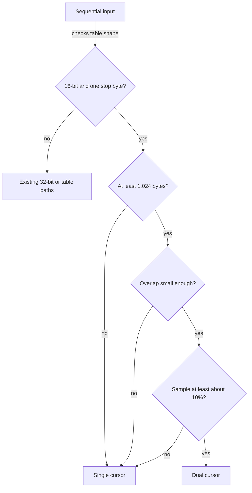

# Chapter 4 — Use two cursors only when there are loads to overlap

> Stack PR 4: `perf/11-dual-density-dispatch` at `566ec04`, direct parent `3d8c3a8`.

## Concept ledger

- Chapter 0 — DFA rows, cache hierarchy, the serial dependency chain, stop bytes, half-width rows, and dual cursors.
- Chapter 1 — regimes, direct-parent A/B comparison, sample count, noise, confidence intervals, and `benchstat`.
- Chapter 2 — sorted child slices, row-copy DFA construction, BFS ordering, and deterministic encoding.
- Chapter 3 — SWAR, the zero-byte trick, SIMD, `bytes.IndexByte`, and the scalar/SWAR/vectorized skip ladder.

## The bottleneck: one winner does not exist

After Chapter 3, every eligible 16-bit single-stop scan used two cursors. That was ideal when input kept the automaton away from the root: two independent transition chains could overlap their table-load waits. But natural text often had long root gaps. The single cursor could skip those gaps in one tight operation, while the dual loop still paid for two lanes, overlap re-scan, and lane coordination.

The commit message measures the split clearly:

- Natural text has about 3–4% stop-byte density; dual loses 10–15% to single.
- Concatenated dictionary words have about 11–15%; dual wins 25–45% on small inputs.

The same algorithm was both faster and slower, depending on regime. The missing optimization was a decision.

## The idea

Sample how often the input contains the root's sole stop byte. If the sample is dense enough, use two cursors. Otherwise, keep the single cursor's cheaper root skip.

That was this commit's whole contract. The dispatch has since grown a second stage: today's code routes through `dualWorthwhile`, where the density sample is only the initial (and fallback) signal, and for sufficiently large inputs sampled mean excursion length can override it in either direction. The "Since this commit" section below describes the current contract; the mechanism walkthrough that follows is the original density-only gate this chapter teaches.

At dinner: **first ask whether there are enough dependent loads to make overlapping them worthwhile.**

## New concept: memory-level parallelism

**Memory-level parallelism**, or MLP, means having several independent memory operations in flight at once.

A single DFA cursor cannot issue its next transition load until the current load returns, because that result is the next state. The waits serialize:

```text
time ─────────────────────────────────────────────────────────►

one cursor
lane A:  issue A0 ── wait ── use A0 / issue A1 ── wait ── use A1
                         ▲                         ▲
                         no next address yet       no next address yet

two independent cursors
lane A:  issue A0 ── wait ── use A0 / issue A1 ── wait ── use A1
lane B:       issue B0 ── wait ── use B0 / issue B1 ── wait ── use B1
              └────────── waits overlap inside the CPU ──────────┘
```

The processor can begin B0 without knowing A0's result because lane B has its own state. This does not make either dependency chain shorter. It keeps the memory machinery busier while one chain waits.

MLP helps only while the scan performs table transitions. During a root gap, Chapter 3's SWAR/`IndexByte` skip does bulk byte search instead. There is little dependent-load latency for a second cursor to hide.

> Want the deep-dive? Ask about out-of-order execution, load buffers, cache misses versus bandwidth, or why two cursors can help even with L1 hits.

## Sampling a cheap proxy

The true quantity is “how much time will this input spend following DFA transitions?” Computing that exactly would require running the scan—the work the dispatcher is trying to choose.

Instead, `looksDense` counts occurrences of the sole root-leaving byte. This **proxy** is not the automaton state trace: a counted byte may occur while already away from the root. But it is cheap and correlates with how often root gaps end. (In today's code it is the first-stage signal inside `dualWorthwhile`; see "Since this commit.")

For inputs up to 4,096 bytes, the helper counts the whole input. For larger inputs, it samples three 1,024-byte windows:

```text
large input
0                                                               n
├──────────┬────────────────┬──────────┬──────────────┬──────────┤
│ head 1KB │    unsampled   │ middle 1KB│  unsampled   │ tail 1KB │
└──────────┴────────────────┴──────────┴──────────────┴──────────┘
     │                              │                         │
     └──────── bytes.Count(c) ──────┴─────────────────────────┘
                         sum = k over 3,072 sampled bytes
```

Head, middle, and tail reduce the risk that one local burst represents the whole input. Sampling avoids a full extra pass over large data. The commit describes three vectorized `bytes.Count` calls as costing roughly tens of nanoseconds.

The threshold is `410 / 4096`, approximately 10% (`trie.go:455-479` at `566ec04`):

```go
// trie.go:463-479 @ 566ec04
const dualDenseThreshold = 410

func looksDense(input []byte, c byte) bool {
    n := len(input)
    if n <= 4096 {
        return bytes.Count(input, []byte{c})*4096 >=
            dualDenseThreshold*n
    }
    k := bytes.Count(input[:1024], []byte{c})
    mid := n / 2
    k += bytes.Count(input[mid:mid+1024], []byte{c})
    k += bytes.Count(input[n-1024:], []byte{c})
    return k*4 >= dualDenseThreshold*3
}
```

The integer cross-multiplication avoids floating-point rounding. For the three-window case, `k/3072 >= 410/4096` becomes `k*4 >= 410*3`.

## A measured threshold, not a magic number

The density-sweep benchmark from Chapter 1 inserts controlled filler between dictionary words and records the resulting density in each benchmark name (`bench_lab_test.go:208-229` at `566ec04`). The commit message reports:

- Word-plus-filler mixtures at 6–9.6% favor single cursor by 6–14%.
- Pure concatenations at 10.9–15% favor dual cursor.

The gap between 9.6% and 10.9% supports a threshold near 10%. It is a measured break-even on Zen 4, not an algorithmic constant. Another CPU can retune it without changing correctness.

## The mechanism: add one speed-only branch

The density check is the last eligibility condition (`trie.go:481-500` at `566ec04`; in today's code the final condition is `dualWorthwhile`, which starts from this same density check — see "Since this commit"):



```go
// trie.go:482-500 @ 566ec04
func (tr *Trie) matchSeq(input []byte, buf *matchBuf) {
    if tr.failTrans16 != nil && len(tr.rootStopBytes) == 1 {
        if len(input) >= dualThreshold &&
            int(tr.maxLen)*4 < len(input)/2 &&
            looksDense(input, tr.rootStopBytes[0]) {
            tr.matchDualStopByte16(input, buf)
            return
        }
        tr.matchStopByte16(input, buf)
        return
    }
    if len(tr.rootStopBytes) == 1 {
        tr.matchStopByte(input, buf)
    } else {
        tr.matchTable(input, buf)
    }
}
```

Go evaluates `&&` left to right and stops on the first false condition. Small inputs and expensive-overlap cases never pay for sampling.

## The numbers

The commit message reports direct-parent A/B results with `n=6–8`:

| Regime | Change |
|---|---:|
| natural text, 100 KB | −9% |
| natural text, 4 KB | −14% |
| dense input | retains the existing dual-cursor win |

The change recovers sparse-text performance without giving back the dense regime.

One source discrepancy remains: `PR-CHAIN.md:27` summarizes the 4 KB text gain as −11%, while the commit message says −14%. This chapter uses the direct-parent commit message and flags the index difference. No benchmarks were re-run locally.

## Why it is safe

This is the key dispatch invariant: **a misclassification can only cost speed; it cannot change output.** The dispatch decision — `looksDense` at this commit, `dualWorthwhile` (density plus excursion voting) today — is read-only. It chooses between `matchStopByte16` and `matchDualStopByte16`, two implementations of the same automaton with the same ordered match stream.

The arithmetic is bounds-safe: the full-count branch handles `n <= 4096`; the three-window branch therefore has valid head, middle, and tail slices. The sample does not mutate input or trie state.

The diff adds no sampler-specific test. Correctness is instead path-independent: focused dual tests compare dual output exactly with sequential output, `TestDifferentialRandom` compares dispatch results with a naive matcher, and `FuzzMatch` includes sparse, dense, dual, and parallel seeds (`dualscan_test.go:136-208`, `differential_test.go:45-103`, and `fuzz_test.go:121-182` at `566ec04`). The density sweep records the performance boundary; it is not a correctness assertion. `PR-CHAIN.md:3-8` says this position passes `go test ./...`.

The sampler can still guess poorly when head, middle, and tail do not represent the unsampled regions. That is acceptable because the fallback consequence is only choosing the slower correct loop.

## Since this commit: excursion voting

Density alone misjudges inputs whose stop bytes are frequent but whose
excursions from the root are short (or the reverse). A later commit
(`489d789`) replaced the bare `looksDense` call in `matchSeq` with
`dualWorthwhile`, which layers a second, more direct sample on top:

1. `looksDense` still runs first and its verdict is the default.
2. If the input is large enough to amortize the cost
   (`len(input) >= dualChainFloor*(maxLen+1024)`), `chainSample` walks
   four 1 KB windows the same way the real scan would (each warmed up
   from `maxLen` bytes before the window so it starts in the exact
   automaton state the real scan holds there) and each window votes
   long, short, or abstain on its local mean excursion length.
3. A majority of decided windows **overrides** the density verdict in
   either direction; ties and all-abstain samples fall back to density.

The windows sit at the 1/8, 3/8, 5/8, and 7/8 points — deliberately
offset from the head/middle/tail windows `looksDense` reads — so the two
signals do not share blind spots. The safety story is unchanged: both
stages are read-only, and a wrong verdict still only picks the slower of
two correct loops.

## Recap

- MLP overlaps two independent transition-load chains, but it helps only when the input actually performs enough transitions.
- Three 1 KB samples estimate stop-byte density; measured break-evens place the Zen 4 threshold near 10%.
- The dispatcher restores sparse-text speed and keeps dense wins, while misclassification remains speed-only.
- Today's `dualWorthwhile` keeps density as the first signal and lets sampled mean excursion length outvote it on large inputs.

## Check yourself

1. Why does a second cursor hide load latency but not shorten either cursor's dependency chain?
2. Why is stop-byte density only a proxy for transition density, and why is an imperfect proxy safe here?

## Optional deep-dives

- CPU load buffers, cache-miss concurrency, and limits on memory-level parallelism.
- A worked derivation of both integer density comparisons.
- Sampling bias for head/middle/tail windows and alternative samplers.
- How to re-measure and retune the threshold on another CPU.
- Assembly comparison of the single- and dual-cursor inner loops.
