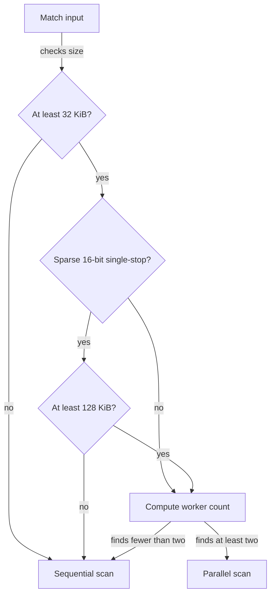

# Chapter 5 — Parallel work must earn its startup cost

> Stack PR 5: `perf/12-parallel-threshold` at `70a9854`, direct parent `566ec04`.

## Concept ledger

- Chapter 0 — DFA rows, cache hierarchy, the serial dependency chain, pooled materialization, dual cursors, and parallel overlap.
- Chapter 1 — regimes, direct-parent A/B comparison, sample count, noise, confidence intervals, and `benchstat`.
- Chapter 2 — sorted child slices, row-copy DFA construction, BFS ordering, and deterministic encoding.
- Chapter 3 — SWAR, SIMD, `bytes.IndexByte`, and the root-gap skip ladder.
- Chapter 4 — memory-level parallelism, stop-byte-density sampling, measured dispatch thresholds, and speed-only misclassification.

## The bottleneck: parallelism began before it could pay

The parent dispatched every input of at least 16 KiB to `matchParallel` when more than one worker was available. That treated “parallel” as inherently faster.

The crossover benchmarks showed otherwise. Sparse single-stop text scans at about 2 GB/s sequentially on the measured Zen 4 host. At 16–96 KiB, the useful scan is so short that goroutine startup, scheduler wakeups, overlap re-scan, and serial merge work cost more than the time saved; sequential wins by 12–28%. Table scans and stop-byte-dense inputs are several times slower, so splitting them pays sooner.

## The idea

Use the Chapter 4 density sampler to classify scan cost before creating workers:

- Sparse, single-stop, 16-bit input: stay sequential until 128 KiB.
- Dense single-stop or any table path: allow parallel scanning from 32 KiB.

At dinner: **the faster the serial loop, the more input parallelism needs before its fixed bill is worth paying.**

## New concept: goroutine startup and wakeup

A goroutine is lightweight, not free. The parallel path must create or schedule workers, obtain pooled buffers, update a `WaitGroup`, and sometimes wake an idle runtime thread. Work may also be stolen between scheduler queues. The main goroutine later waits for all workers.

These costs are mostly fixed per call or per worker. Scanning cost grows with input size. That creates a crossover rather than a universal winner.

```text
Conceptual cost curves — not measured y-values

elapsed time                         elapsed time
^                                    ^
│ parallel ─────╲                    │ parallel ──╲
│                ╲                   │             ╲
│ sparse serial ──╲────              │ dense/table  ╲────
│                  × crossover       │ serial ───────×───
│                  near 128 KiB      │        crossover near 32 KiB
└────────────────────────► size      └────────────────────────► size

Parallel starts with a higher fixed cost but has a lower large-input slope.
```

> Want the deep-dive? Ask about Go's G-M-P scheduler, worker wakeups, work stealing, or why goroutine cost varies with runtime state.

## Crossover math

Let:

- `N` be input bytes.
- `S` be serial scan throughput in bytes per second.
- `p` be worker count.
- `O = maxLen - 1` be overlap bytes re-scanned by each non-first worker.
- `H(p)` be startup, scheduling, and waiting overhead.
- `M` be the serial merge and materialization tail.

A simple model is:

```text
Tserial   ≈ N / S
Tparallel ≈ H(p) + (N/p + O) / S + M

parallel wins when:
N/S - (N/p + O)/S  >  H(p) + M
└──── scan time saved ────┘     └─ parallel bill ─┘
```

This is a teaching model, not the benchmark's fitting formula. Real workers share caches and memory bandwidth. But it explains the threshold split: when `S` is large, the left side grows slowly, so `N` must be larger. When a table path is several times slower, parallel work saves more time per byte and crosses earlier.

## Why overlap is both necessary and costly

Chapter 0 proved the boundary rule. Here it becomes part of the cost model. Each worker after the first starts `maxLen-1` bytes before its owned chunk (`trie.go:755-800` at `70a9854`):

```text
input:       0                   B                   2B
             ├── worker 0 owns ─┼── worker 1 owns ──┤
worker 0:    [ scan ─────────────)
worker 1:              [overlap][ scan ─────────────)
                       ◄─ L-1 ─►
worker 1 emit:                     [ends >= B only ──)

Correctness gain: a match crossing B is found.
Performance cost: overlap bytes are scanned twice.
```

After scanning, the main goroutine waits, appends each worker's raw results into one buffer, and materializes matches (`trie.go:805-837` at `70a9854`). At this point in the chain, that fan-in is serial. Chapter 10 will remove much of that tail.

The implementation has a second guard: if overlap is more than one quarter of a chunk, `matchParallel` sets `p=0` and scans sequentially. The public threshold and the overlap guard answer different questions: “is the input large enough in general?” and “is this particular pattern length cheap enough to partition?”

## The mechanism: choose the floor by regime

The previous rule was simply `len(input) >= 2*parallelChunk`, or 16 KiB. The new dispatcher reuses `looksDense` (`trie.go:416-461` at `70a9854`):

```go
// trie.go:421-440 @ 70a9854
func (tr *Trie) Match(input []byte) []*Match {
    if len(input) >= 32<<10 {
        pmin := 32 << 10
        if tr.failTrans16 != nil && len(tr.rootStopBytes) == 1 &&
            !looksDense(input, tr.rootStopBytes[0]) {
            pmin = 128 << 10
        }
        if len(input) >= pmin {
            if p := min(runtime.GOMAXPROCS(0),
                len(input)/parallelChunk, 8); p > 1 {
                return tr.matchParallel(input, p)
            }
        }
    }
    ... // pooled sequential path
}
```



`parallelChunk` remains 8 KiB for sizing worker count. Thus a 32 KiB dense/table input can request up to four workers, while worker count remains capped at eight and by `GOMAXPROCS`.

## The numbers

The commit message reports direct-parent A/B measurements with `n=6` on the sparse single-stop automaton:

| Input | Change |
|---|---:|
| 32 KiB | −32% |
| 64 KiB | −36% |
| 100 KiB | −25% |

Those gains come from staying sequential where the parent started workers. Dense and table paths are reported unchanged. `PR-CHAIN.md:28` at `bf7fde9` summarizes the same range as −25% to −36% for 32–100 KiB sparse inputs. No benchmarks were re-run locally.

## Why it is safe

This is another speed-only dispatch: **a threshold mistake can choose a slower correct path, but cannot change matches.** The sampler is read-only, and both branches eventually run the same DFA semantics.

Parallel correctness still rests on the `maxLen-1` overlap and ownership rule: a worker emits only matches ending in its own chunk. `TestMatchParallelDifferential` bypasses runtime thresholds, injects worker counts 2, 3, 4, and 8, and compares exact output with the naive matcher (`differential_test.go:105-149` at `70a9854`). `TestRootSkipSplitBoundaries` plants matches around midpoints and chunk boundaries, including a 131,072-byte case (`rootskip_test.go:184-239`). `PR-CHAIN.md:3-8` at `bf7fde9` says every position passes `go test ./...`, and the full chain passes the race detector and fuzz gates.

The diff adds no test file, and it leaves some test comments stale. `fuzz_test.go:129-167` still says parallel scanning begins at 16 KiB; its sparse 40,000-byte and dense 20,000-byte seeds no longer dispatch through the new public threshold. `rootskip_test.go:184-186` also names the old threshold. Direct `TestMatchParallelDifferential` remains reliable because it calls `matchParallel` explicitly. The code at `70a9854` is authoritative: the floors are 32 and 128 KiB.

The trade-off is host sensitivity. Startup cost, serial throughput, and available workers differ by CPU and Go runtime. The constants are measured policy, not correctness limits, so they can be retuned with the Chapter 1 crossover matrix.

## Recap

- Parallel time includes startup, wakeup, overlap re-scan, waiting, and a serial merge tail; those costs need enough scan work to amortize.
- Sparse single-stop scanning is fast enough to need a 128 KiB floor, while dense and table paths cross near 32 KiB.
- Dispatch errors remain speed-only because sequential and parallel paths preserve the same ordered match stream.

## Check yourself

1. In the cost model, why does higher serial throughput move the parallel crossover to a larger input?
2. Why does each non-first worker need `maxLen-1` overlap, and why must it discard outputs ending inside that overlap?

## Optional deep-dives

- Go scheduler startup, wakeup, and work-stealing mechanics.
- A numerical crossover calculation using measured throughput and overhead.
- How merge cost changes with match density.
- How to design a reliable sequential-versus-parallel benchmark sweep.
- Why Chapter 10 must remove the serial materialization tail before worker count can scale further.
