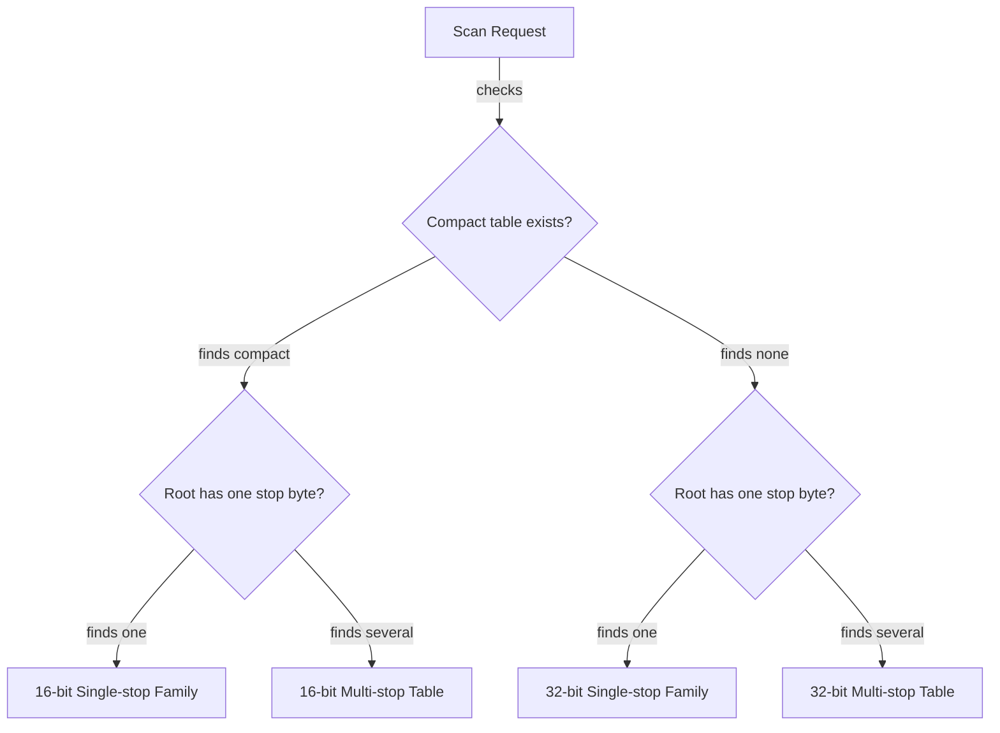

# Chapter 6 — Half the row, more room in cache

> Stack PR 6: `perf/13-16bit-multi-stop` at `d7088b3`, direct parent `70a9854`.

## Concept ledger

- Chapter 0 — DFA rows, cache hierarchy, the serial dependency chain, pooled materialization, dual cursors, and parallel overlap.
- Chapter 1 — regimes, direct-parent A/B comparison, sample count, noise, confidence intervals, and `benchstat`.
- Chapter 2 — sorted child slices, row-copy DFA construction, BFS ordering, and deterministic encoding.
- Chapter 3 — SWAR, SIMD, `bytes.IndexByte`, and the root-gap skip ladder.
- Chapter 4 — memory-level parallelism, stop-byte-density sampling, measured dispatch thresholds, and speed-only misclassification.
- Chapter 5 — goroutine startup and wakeup, parallel crossover math, overlap re-scan, and serial merge cost.

## Act III — Multi-stop tries

The previous three chapters tuned the fast path for tries whose patterns all begin with one byte. This act turns to tries with several first bytes. Their root skip uses a lookup table, and—before this commit—their state transitions also used the widest table even when every state fit in half the bits.

## The bottleneck: a compact table that the hot loops could not use

The library already built `failTrans16`, a compact transition table, for small single-stop tries. Each entry used 16 bits instead of 32. But the builder refused to create it for multi-stop tries, `Match` routed those tries through `matchTable`, and `Walk` always used 32-bit loops.

The old choice was sensible while no multi-stop loop could read the compact copy: building it would only retain another 512 bytes per state. Once compact multi-stop loops exist, that same memory becomes a useful cache investment.

This diagram separates **resident size** from the **hot scan footprint**. The full table remains allocated after the change.

```text
Per automaton state: 256 byte-indexed transitions

Parent — multi-stop, small trie
resident:  ┌───────────────────────────────┐
           │ failTrans: 256 × 4B = 1,024B │
           └───────────────────────────────┘
hot scan:  └──────── reads this 1,024B row ────────►

After — multi-stop, small trie
resident:  ┌───────────────────────────────┬──────────────────────────┐
           │ failTrans: 256 × 4B = 1,024B │ failTrans16: 256 × 2B = 512B │
           └───────────────────────────────┴──────────────────────────┘
hot scan:                                  └── reads this 512B row ──►

Cost: 512B more resident memory per state.
Gain: half-sized rows on the serial transition-load chain.
```

## The idea

If every state ID fits in 15 bits, build the compact table for every trie and give both `Match` and `Walk` a 16-bit loop for each root shape.

At dinner: **spend some heap memory on a second table so the CPU's small, fast caches hold twice as much of the table the scan actually reads.**

## New concept: cache footprint is a design knob

A cache does not care how elegant a data structure is. It cares how many bytes the active code repeatedly touches. That active byte range is the **hot footprint**.

On the measured Zen 4 CPU, a cache line is 64 bytes. A 1,024-byte row spans 16 lines and fits 16 four-byte transitions per line. A 512-byte row spans 8 lines and fits 32 two-byte transitions per line. A scan still loads only the entries it needs, but each fetched line covers twice as many possible input bytes, and more rows can remain cached at once.

This matters because the next row address depends on the state returned by the current load. Chapter 0 called that the serial dependency chain. A cache miss cannot be hidden by issuing the next dependent transition early. Shrinking the table improves the chance that the needed line is already nearby.

> Want the deep-dive? Ask how set-associative caches, cache-line replacement, and hardware prefetchers interact with state-dependent table lookups.

## Packing one transition into 16 bits

The full-width entry stores an output flag above a state ID. The compact entry keeps the same meaning, but moves the flag down to bit 15:

```text
32-bit failTrans entry
 31  30                                      0
┌───┬─────────────────────────────────────────┐
│ O │              state ID                   │
└───┴─────────────────────────────────────────┘

16-bit failTrans16 entry
 15  14                                      0
┌───┬─────────────────────────────────────────┐
│ O │        state ID, at most 32,767         │
└───┴─────────────────────────────────────────┘

O = target state emits at least one pattern
```

The gate is `len(failTrans) <= 1<<15`. Therefore the largest valid state ID is at most 32,767, leaving bit 15 free. Construction copies the state and remaps the flag (`trie.go:161-184` at `d7088b3`):

```go
func (tr *Trie) buildFailTrans16() {
    tr.failTrans16 = nil
    if len(tr.failTrans) > 1<<15 {
        return
    }
    tr.failTrans16 = make([]uint16, len(tr.failTrans)*256)
    for s := range tr.failTrans {
        for b := range 256 {
            v := tr.failTrans[s][b]
            w := uint16(v & stateMask)
            if v&outputFlag != 0 {
                w |= 1 << 15
            }
            tr.failTrans16[s<<8+b] = w
        }
    }
}
```

Before this commit, the guard also required exactly one root stop byte. The diff removes that condition. The parent comment quantified the formerly unused compact copy as about 10 MB for a 20,000-state multi-stop dictionary (`trie.go:161-168` at `70a9854`). This commit deliberately pays that cost because the new loops read the copy.

## The mechanism: select width first, then root family

The dispatcher now asks two independent questions: “Can state IDs use 15 bits?” and “Does the root leave on one byte or several?”



`Walk` gains `walkStopByte16` and `walkTable16`. `matchSeq` keeps its existing single-stop 16-bit path and adds `matchTable16` for compact multi-stop tries (`trie.go:288-302,587-609` at `d7088b3`):

```go
func (tr *Trie) Walk(input []byte, fn WalkFn) {
    if tr.failTrans16 != nil {
        if len(tr.rootStopBytes) == 1 {
            tr.walkStopByte16(input, fn)
        } else {
            tr.walkTable16(input, fn)
        }
        return
    }
    ... // choose the 32-bit single-stop or table loop
}

func (tr *Trie) matchSeq(input []byte, buf *matchBuf) {
    ... // existing 16-bit single-stop dispatch
    if len(tr.rootStopBytes) == 1 {
        tr.matchStopByte(input, buf)
    } else if tr.failTrans16 != nil {
        tr.matchTable16(input, buf)
    } else {
        tr.matchTable(input, buf)
    }
}
```

The compact table is flat. Its transition address is:

```text
full:    base + state × 1,024 + inputByte × 4
compact: base + state ×   512 + inputByte × 2
```

That becomes `state<<9 + byte<<1` in the real loop. The loaded entry is widened to `uint32`, bit 15 is removed to recover the state, and the same bit decides whether to inspect output metadata (`trie.go:1078-1087` at `d7088b3`):

```go
v := uint32(*(*uint16)(unsafe.Add(
    ftBase, uintptr(s)<<9+uintptr(input[i])<<1)))
s = v &^ (1 << 15)
if v&(1<<15) != 0 {
    if dp := *(*uint64)(unsafe.Add(dpBase, uintptr(s)<<3)); uint32(dp) != 0 {
        buf.raw = append(buf.raw, uint64(i), dp)
    }
    ... // emit dictionary-link matches
}
```

The raw-pointer idiom was introduced in Chapter 0. Here the safety condition is unchanged: construction allocates exactly `states × 256` entries, and every packed state came from a valid full-width entry.

## `stopEntry16`: replace a dependent lookup with a constant

A single-stop trie has only one byte `c` that can leave the root. Whenever a scan is at the root and finds `c`, the transition is always `failTrans16[root][c]`. `setStopEntry` caches that value once.

```text
Several stop bytes at root:            One stop byte at root:
input byte chooses transition          useful transition is fixed

root + 'a' ─► row['a']                 root + c ─► stopEntry16
root + 'b' ─► row['b']                              (constant)
root + 'c' ─► row['c']
```

`walkStopByte16` now uses `stopEntry16` on every root re-entry and loads the compact table only away from root (`trie.go:307-345` at `d7088b3`). That removes one dependent table access from a common path. Multi-stop loops cannot use one constant because the next state depends on which stop byte arrived.

## The numbers

The `d7088b3` commit message reports direct-parent A/B results with `n=6–8`:

| Regime | Change vs `70a9854` |
|---|---:|
| Small multi-stop, 1 KiB and 4 KiB inputs | −5% to −9% |
| Small multi-stop, 100 KiB input | about 0 |
| `Walk`, single-stop, 100 KiB | −8% to −9% |
| `Walk`, multi-stop | −3% |
| `MatchFirst`, late match | −6% |

The first row measures the new `matchTable16` path. The `Walk` rows measure the new callback loops, and `MatchFirst` benefits because it is implemented by `Walk`. `PR-CHAIN.md:29` at `bf7fde9` summarizes the same change as multi-stop small −5% to −9%, single-stop `Walk` −9.5%, and `MatchFirst` −6%. No benchmarks were re-run locally.

The 100 KiB multi-stop result is deliberately reported as neutral rather than hidden. Halving a hot structure is not a promise that every surrounding regime moves; input size, root skipping, output work, and Chapter 5's parallel dispatcher can dominate elsewhere.

## Why it is safe

This commit changes representation and dispatch, not automaton semantics:

- The size gate proves every state ID survives the 16-bit conversion.
- Each compact entry copies the exact state and output predicate from its 32-bit source.
- The 16-bit loops preserve root skipping, transition order, dictionary-link traversal, callback termination, and raw match order.
- Builder and decoder both regenerate `failTrans16` and `stopEntry16`; these derived tables are not persisted in the wire format (`builder.go:272-275` and `stream.go:233-238` at `d7088b3`).

`TestFailTrans16Gate` changes its contract: a small multi-stop trie must now have the compact table, and its sample input must still return three matches (`trie_test.go:274-296`). `FuzzMatch` compares `Match`, `Walk`, and `MatchFirst` exactly against the naive matcher. `FuzzEncodeDecode` checks the rebuilt derived tables after a round trip. The chain index reports `go test ./...` at every stack position plus race, checkptr, and fuzz gates for the full chain.

There are stale comments at this commit. `Trie.failTrans16` still says the table is built only for a single-stop matcher (`trie.go:53-59`). `BenchmarkLabMultiStop`, `FuzzMatch`, and `TestRootSkipMultiStopByteTable` still name the old 32-bit path even though these small multi-stop fixtures now route through `matchTable16` or `walkTable16`. The updated builder gate, dispatch code, and `TestFailTrans16Gate` are authoritative. (The field comment and the `FuzzMatch`/`TestRootSkipMultiStopByteTable` comments have since been corrected to name the 16-bit paths; `BenchmarkLabMultiStop` was reworded when the small multi-stop benchmark split out.)

## Recap

- A 16-bit transition entry packs a 15-bit state ID plus the same output flag, shrinking each hot row from 1,024 to 512 bytes.
- Small tries now pay 512 extra resident bytes per state so both single-stop and multi-stop `Match`/`Walk` loops can read the compact table.
- `stopEntry16` turns the sole useful root transition into a constant, removing a dependent table load from the single-stop `Walk` path.

## Check yourself

1. Why can a program use more total heap memory while presenting a smaller hot footprint to the CPU cache?
2. What fact proves that bit 15 is available for the output flag without truncating a state ID?

## Optional deep-dives

- Set-associative caches and why “half the footprint” does not imply “twice as fast.”
- A byte-by-byte proof that 32-bit and 16-bit transition entries decode identically.
- How `unsafe.Add` computes the flattened row offset and what checkptr can catch.
- Why `MatchFirst` inherits `Walk` performance instead of using `Match`.
- How to benchmark memory-for-speed trade-offs, including build-time and resident-memory costs.
